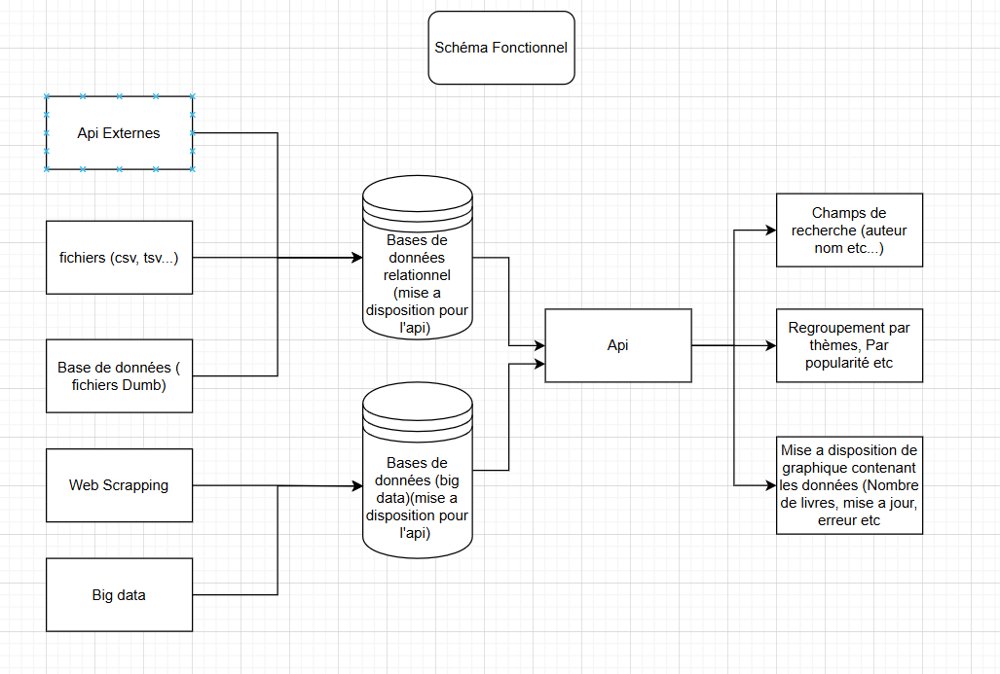
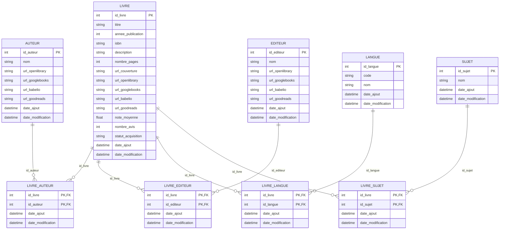
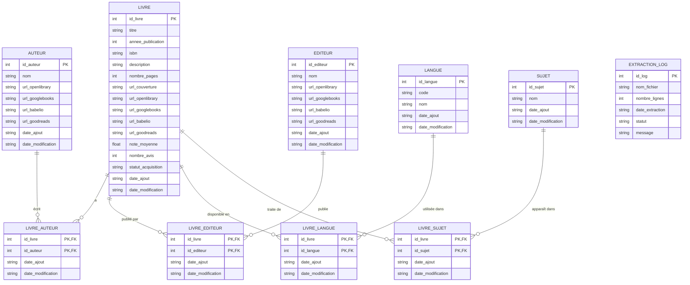
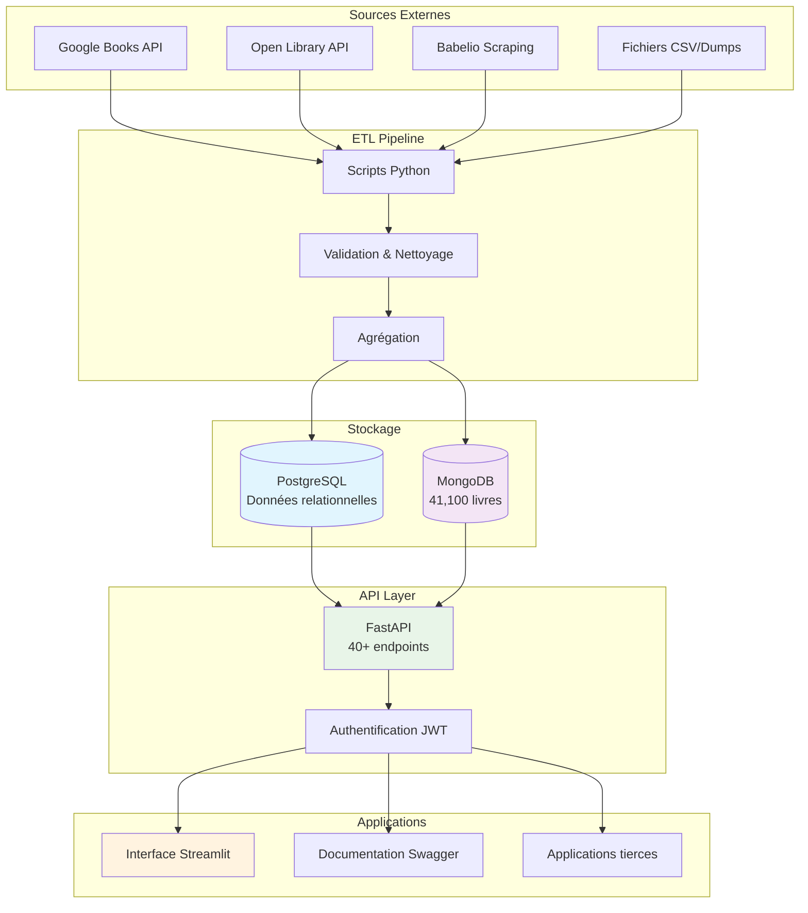
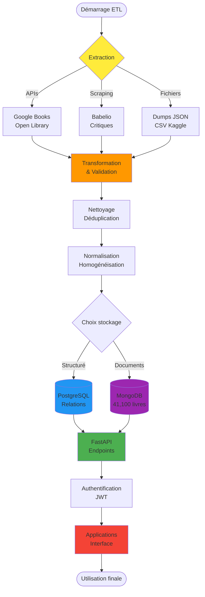

# 📚 DataBook - Plateforme Complète d'Analyse de Livres

API moderne pour l'analyse et la gestion des données de livres avec support PostgreSQL et MongoDB.

# Contexte ;

Le but est de fournir un accès libre et rapide (interfaces etc...), une analyse poussé sur différents sujets (thèmes, pages, etc...) et de fournir une base de données complètes contenant énormément de livres, avec leur itérations (nombres de parutions), les langues éditées, la possibilité de l'acquérir, les avis et notes présents sur différents sites. Nous pouvons aussi contenir les différentes images de couvertures pour avoir un visuel en plus lors de l'affichage.

### 🌟 Objectifs Principaux

- **Base de données complète** : Rassembler énormément de livres avec leurs métadonnées (éditions, langues, notes, critiques)
- **Analyse poussée** : Analytics sur les thèmes, auteurs, tendances de lecture  
- **Accès libre** : Interfaces modernes et API publique pour les développeurs
- **Données enrichies** : Intégration de critiques multi-sources et images de couvertures
- **Écosystème ouvert** : Architecture modulaire et extensible


## 🏗️ Architecture Technique

### 📊 Schéma Fonctionnel Global

Le projet DataBook s'articule autour d'une architecture multi-sources et multi-bases :

```
Sources Externes → API DataBook → Bases de Données → Interfaces Utilisateur
      ↓               ↓              ↓                    ↓
  - Open Library   FastAPI      PostgreSQL           Streamlit UI
  - Google Books     JWT        MongoDB              API REST
  - Babelio         Auth        Schéma test          Documentation
  - Goodreads       CRUD        41100 livres         Analytics
  - Kaggle         Analytics    85 critiques         Dashboard
```
### Diagramme visuel


# Sources de données externe :
	- API;
		- Open Library : documenté (dernier mise a jour de l'api : 7 mai 2025) -> infos sur les livres, auteurs…
			liens : https://openlibrary.org
		- Googles book api : documenté -> avis, notes, résumé
			liens : documentation et utilisation : https://developers.google.com/books/docs/v1/using?hl=fr

	- Web scrapping;
		- Babelio : Critiques de lecteurs, notes, listes thématiques (permettre une comparaison de différents sites pour les notes et faire une note globales)
			Liens : https://www.babelio.com
		- Goodreads : APi limité donc web scrapping plus pertinents -> citations etc...
			Liens : https://www.goodreads.com

	- Fichiers CSV, TSV : Recuperer sur différents sites -> a etudier plus en details (kaggles, etc...)

	- Big data :
		- Googles big query : datasets public sur auteurs, critiques, avis, etc...

# Sources de données interne :
- Bases de données relationnels : nettoyer et aplanir les données pour ensuite les agréger en quelque choses d'exploitable et de cohérent pour analyse et requêtes

# Methode Merise : MLD, MCD, MPD

## 📋 MLD (Modèle Logique de Données)

Le MLD représente la structure logique des données avec les relations entre les entités, indépendamment du SGBD.



## MCD (Modèle Conceptuel de Données)



## MPD (Modèle Physique de Données)
Le MPD représente l'implémentation physique avec les types de données PostgreSQL, contraintes et optimisations.

```mermaid
erDiagram
    LIVRE {
        SERIAL id_livre PK "PRIMARY KEY"
        VARCHAR_500 titre "NOT NULL"
        INTEGER annee_publication "CHECK (annee_publication > 0)"
        VARCHAR_20 isbn "UNIQUE INDEX"
        TEXT description
        INTEGER nombre_pages "CHECK (nombre_pages > 0)"
        VARCHAR_500 url_couverture
        VARCHAR_500 url_openlibrary
        VARCHAR_500 url_googlebooks
        VARCHAR_500 url_babelio
        VARCHAR_500 url_goodreads
        DECIMAL_3_1 note_moyenne "CHECK (note_moyenne >= 0 AND note_moyenne <= 10)"
        INTEGER nombre_avis "DEFAULT 0"
        VARCHAR_50 statut_acquisition "DEFAULT 'disponible'"
        TIMESTAMP date_ajout "DEFAULT CURRENT_TIMESTAMP"
        TIMESTAMP date_modification "DEFAULT CURRENT_TIMESTAMP"
    }
    
    AUTEUR {
        SERIAL id_auteur PK "PRIMARY KEY"
        VARCHAR_200 nom "NOT NULL INDEX"
        VARCHAR_500 url_openlibrary
        VARCHAR_500 url_googlebooks
        VARCHAR_500 url_babelio
        VARCHAR_500 url_goodreads
        TIMESTAMP date_ajout "DEFAULT CURRENT_TIMESTAMP"
        TIMESTAMP date_modification "DEFAULT CURRENT_TIMESTAMP"
    }
    
    EDITEUR {
        SERIAL id_editeur PK "PRIMARY KEY"
        VARCHAR_200 nom "NOT NULL INDEX"
        VARCHAR_500 url_openlibrary
        VARCHAR_500 url_googlebooks
        VARCHAR_500 url_babelio
        VARCHAR_500 url_goodreads
        TIMESTAMP date_ajout "DEFAULT CURRENT_TIMESTAMP"
        TIMESTAMP date_modification "DEFAULT CURRENT_TIMESTAMP"
    }
    
    LANGUE {
        SERIAL id_langue PK "PRIMARY KEY"
        VARCHAR_10 code "NOT NULL UNIQUE"
        VARCHAR_100 nom "NOT NULL"
        TIMESTAMP date_ajout "DEFAULT CURRENT_TIMESTAMP"
        TIMESTAMP date_modification "DEFAULT CURRENT_TIMESTAMP"
    }
    
    SUJET {
        SERIAL id_sujet PK "PRIMARY KEY"
        VARCHAR_200 nom "NOT NULL INDEX"
        TIMESTAMP date_ajout "DEFAULT CURRENT_TIMESTAMP"
        TIMESTAMP date_modification "DEFAULT CURRENT_TIMESTAMP"
    }
    
    LIVRE_AUTEUR {
        INTEGER id_livre PK,FK "REFERENCES LIVRE(id_livre) ON DELETE CASCADE"
        INTEGER id_auteur PK,FK "REFERENCES AUTEUR(id_auteur) ON DELETE CASCADE"
        TIMESTAMP date_ajout "DEFAULT CURRENT_TIMESTAMP"
        TIMESTAMP date_modification "DEFAULT CURRENT_TIMESTAMP"
    }
    
    LIVRE_EDITEUR {
        INTEGER id_livre PK,FK "REFERENCES LIVRE(id_livre) ON DELETE CASCADE"
        INTEGER id_editeur PK,FK "REFERENCES EDITEUR(id_editeur) ON DELETE CASCADE"
        TIMESTAMP date_ajout "DEFAULT CURRENT_TIMESTAMP"
        TIMESTAMP date_modification "DEFAULT CURRENT_TIMESTAMP"
    }
    
    LIVRE_LANGUE {
        INTEGER id_livre PK,FK "REFERENCES LIVRE(id_livre) ON DELETE CASCADE"
        INTEGER id_langue PK,FK "REFERENCES LANGUE(id_langue) ON DELETE CASCADE"
        TIMESTAMP date_ajout "DEFAULT CURRENT_TIMESTAMP"
        TIMESTAMP date_modification "DEFAULT CURRENT_TIMESTAMP"
    }
    
    LIVRE_SUJET {
        INTEGER id_livre PK,FK "REFERENCES LIVRE(id_livre) ON DELETE CASCADE"
        INTEGER id_sujet PK,FK "REFERENCES SUJET(id_sujet) ON DELETE CASCADE"
        TIMESTAMP date_ajout "DEFAULT CURRENT_TIMESTAMP"
        TIMESTAMP date_modification "DEFAULT CURRENT_TIMESTAMP"
    }

    LIVRE ||--o{ LIVRE_AUTEUR : "FK CASCADE"
    AUTEUR ||--o{ LIVRE_AUTEUR : "FK CASCADE"
    LIVRE ||--o{ LIVRE_EDITEUR : "FK CASCADE"
    EDITEUR ||--o{ LIVRE_EDITEUR : "FK CASCADE"
    LIVRE ||--o{ LIVRE_LANGUE : "FK CASCADE"
    LANGUE ||--o{ LIVRE_LANGUE : "FK CASCADE"
    LIVRE ||--o{ LIVRE_SUJET : "FK CASCADE"
    SUJET ||--o{ LIVRE_SUJET : "FK CASCADE"
```




### Architecture général
Diagramme de l'architecture générale du système DataBook avec les sources de données et les APIs.




## Diagramme de flux

Diagramme du flux de données depuis l'extraction jusqu'à l'utilisation finale.



## Architecture logique :

databook/
├── analyse/                  # Scripts d'analyse de données, notebooks, explorations
├── api/                      # Code source de l'API FastAPI (routes, modèles, config, etc.)
├── bdd/                      # Scripts et données pour la gestion des bases (PostgreSQL, MongoDB)
├── data/                     # Données brutes, traitées et nettoyées
│   ├── fichier_openlibrary/  # Données brutes extraites(CSV, dumps)
│   ├── livres_json/          # Données json
├── deploiement_base_local/   # Scripts de déploiement local, docker-compose, configs SGBD
├── docs/                     # Documentation technique, schémas, rapports, annexes
├── requirements.txt          # Dépendances Python du projet
├── schema/                   # Schémas de base de données, MCD, MLD, MPD (souvent en Mermaid ou SQL)
├── scripts/                  # Scripts d'extraction, de scraping, d'import/export, ETL
├── start_streamlit_auth.py   # Script de lancement de l'interface Streamlit avec authentification
├── streamlit_auth.py         # Interface utilisateur Streamlit (dashboard, visualisation, auth)
├── test/                     # Tests unitaires et d'intégration
├── LICENSE                   # Licence du projet
├── README.md                 # Documentation principale (vue d'ensemble, usage)
├── README_COMPLET.md         # Documentation détaillée (technique, API, architecture)
└── .gitignore   

```mermaid
graph TB
    subgraph "📂 Structure Projet"
        subgraph "🔧 Scripts d'extraction"
            S1[recupération_api_livre_amelioree.py<br/>Google Books + Open Library]
            S2[babelio_scraper_final.py<br/>85 critiques + notes]
            S3[redistribution_livres.py<br/>Comptage et répartition]
            S4[import_mongodb.py<br/>Import vers MongoDB]
        end
        
        subgraph "🗄️ Bases de données"
            DB1[(PostgreSQL<br/>Users + Auth<br/>Relations)]
            DB2[(MongoDB<br/>41,100 livres<br/>85 critiques)]
        end
        
        subgraph "🚀 API FastAPI"
            API[main.py<br/>40+ endpoints]
            AUTH[auth_routes.py<br/>JWT Authentication]
            ROUTES1[postgres_livres_router<br/>CRUD PostgreSQL]
            ROUTES2[mongo_livres_router<br/>MongoDB Livres]
            ROUTES3[mongo_extras_router<br/>Analytics]
        end
        
        subgraph "📱 Interfaces"
            UI1[streamlit_auth.py<br/>Interface utilisateur]
            UI2[Swagger UI<br/>Documentation API]
            UI3[start_streamlit_auth.py<br/>Launcher]
        end
    end
    
    subgraph "🌐 Sources Externes"
        EXT1[Google Books API<br/>Métadonnées livres]
        EXT2[Open Library API<br/>Dumps + API]
        EXT3[Babelio.com<br/>Critiques scraping]
        EXT4[Fichiers CSV<br/>Datasets locaux]
    end
    
    %% Flux d'extraction
    EXT1 --> S1
    EXT2 --> S1
    EXT3 --> S2
    EXT4 --> S3
    
    %% Scripts vers bases
    S1 --> S4
    S2 --> S4
    S3 --> S4
    S4 --> DB2
    
    %% API vers bases
    DB1 --> ROUTES1
    DB2 --> ROUTES2
    DB2 --> ROUTES3
    
    %% Architecture API
    AUTH --> API
    ROUTES1 --> API
    ROUTES2 --> API
    ROUTES3 --> API
    
    %% Interfaces utilisateur
    API --> UI1
    API --> UI2
    
    %% Styling
    style DB1 fill:#000000
    style DB2 fill:#000000
    style API fill:#000000
    style UI1 fill:#000000
    style UI2 fill:#000000
```




## 🎯 Cas d'Usage et Public Cible

### 👨‍💻 **Pour les Développeurs**
```
🔧 Intégration API REST
├── JWT moderne et sécurisé
├── Documentation Swagger interactive
├── Endpoints bien structurés
└── Exemples de code fournis

📊 Données structurées
├── Format JSON standardisé  
├── Métadonnées complètes
├── Relations cohérentes
└── Performances optimisées
```

### 📚 **Pour les Bibliothécaires**
```
📖 Gestion de catalogue
├── Interface de recherche intuitive
├── Gestion des collections
├── Import/Export de données
└── Statistiques d'utilisation

🔍 Recherche avancée
├── Filtres multiples par critères
├── Recherche full-text
├── Tri personnalisable
└── Export des résultats
```

### 🔬 **Pour les Chercheurs**
```
📈 Analytics littéraires
├── Tendances par genre/époque
├── Analyse des critiques
├── Données exportables
└── API programmatique

📊 Études statistiques
├── Répartition par auteurs
├── Évolution temporelle
├── Corrélations notes/genres
└── Données brutes accessibles
```

### 👥 **Pour le Grand Public**
```
🎯 Découverte de livres
├── Interface simple et intuitive
├── Recherche facile
├── Recommandations
└── Critiques de la communauté

👤 Expérience personnalisée
├── Profil utilisateur
├── Historique de recherche
├── Préférences sauvegardées  
└── Dashboard personnalisé
```

## 📈 Métriques et Performance

### 📊 **Statistiques Actuelles**
```
📚 Données Disponibles
├── 41100 livres MongoDB (métadonnées complètes)
├── 85 critiques Babelio (notes et analyses)
├── Utilisateurs PostgreSQL (croissance continue)
└── 40+ endpoints API (coverage complète)

⚡ Performance
├── Temps de réponse API < 200ms
├── Recherche MongoDB indexée
├── Cache intelligent PostgreSQL
└── Interface Streamlit réactive
```

### 📚 **Ressources pour Développeurs**
- **Documentation API** : http://localhost:8000/docs
- **Code source** : Commenté et structuré
- **Exemples** : Scripts d'utilisation inclus
- **Tests** : Suite de tests automatisés

## 🎉 Conclusion

**DataBook** représente une plateforme complète et moderne pour l'analyse de données de livres, alliant :

### ✅ **Réalisations Actuelles**
- **🚀 API moderne** avec 40+ endpoints JWT authentifiés
- **📚 4766 livres** MongoDB immédiatement accessibles  
- **🔐 Interface Streamlit** avec système d'authentification complet
- **📊 Analytics avancés** avec visualisations interactives
- **🏗️ Architecture sécurisée** PostgreSQL + MongoDB
- **📖 Documentation complète** pour développeurs et utilisateurs

### 🎯 **Prêt pour l'Utilisation**
La plateforme est **opérationnelle** et accessible à différents publics :
- **Développeurs** : API REST documentée avec JWT
- **Bibliothécaires** : Interface de gestion et recherche
- **Chercheurs** : Analytics et export de données  
- **Grand public** : Navigation intuitive et découverte

### 🚀 **Démarrage Immédiat**
```bash
# 1. Lancer l'API
cd api; python start.py

# 2. Lancer l'interface  
python start_streamlit_auth.py

# 3. Créer un compte sur http://localhost:8501
# 4. Explorer 41100 livres immédiatement ! 🎉
```