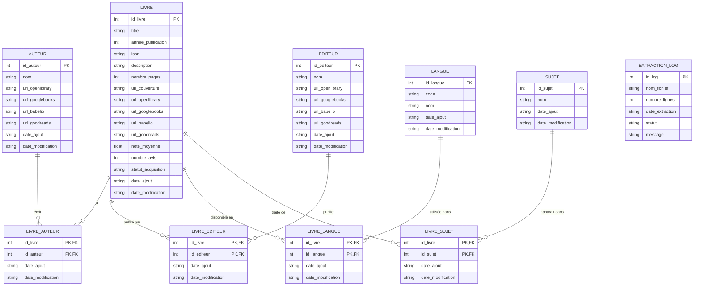

# Contexte ;

Le but est de fournir un accès libre et rapide (interfaces etc...), une analyse poussé sur différents sujets (thèmes, pages, etc...) et de fournir une base de données complètes contenant énormément de livres, avec leur itérations (nombres de parutions), les langues éditées, la possibilité de l'acquérir, les avis et notes présents sur différents sites. Nous pouvons aussi contenir les différentes images de couvertures pour avoir un visuel en plus lors de l'affichage.

# Objectif :
- Fournir une base de données complètes contenant énormément de livres, avec leur itérations (nombres de parutions), les langues éditées, la possibilité de l'acquérir, les avis et notes présents sur différents sites. Nous pouvons aussi contenir les différentes images de couvertures pour avoir un visuel en plus lors de l'affichage.

# Schema fonctionnel :

# Sources de données externe :
	- API;
		- Open Library : documenté (dernier mise a jour de l'api : 7 mai 2025) -> infos sur les livres, auteurs…
			liens : https://openlibrary.org
		- Googles book api : documenté -> avis, notes, résumé
			liens : documentation et utilisation : https://developers.google.com/books/docs/v1/using?hl=fr

	- Web scrapping;
		- Babelio : Critiques de lecteurs, notes, listes thématiques (permettre une comparaison de différents sites pour les notes et faire une note globales)
			Liens : https://www.babelio.com
		- Goodreads : APi limité donc web scrapping plus pertinents -> citations etc...
			Liens : https://www.goodreads.com

	- Fichiers CSV, TSV : Recuperer sur différents sites -> a etudier plus en details (kaggles, etc...)

	- Big data :
		- Googles big query : datasets public sur auteurs, critiques, avis, etc...

# Sources de données interne :
- Bases de données relationnels : nettoyer et aplanir les données pour ensuite les agréger en quelque choses d'exploitable et de cohérent pour analyse et requêtes

## MCD (Mermaid)

## Architecture logique :

data_book
├───data
│   ├───raw
│   ├───processed
│   └───cleaned
├───src
├───docs
└───README.md

