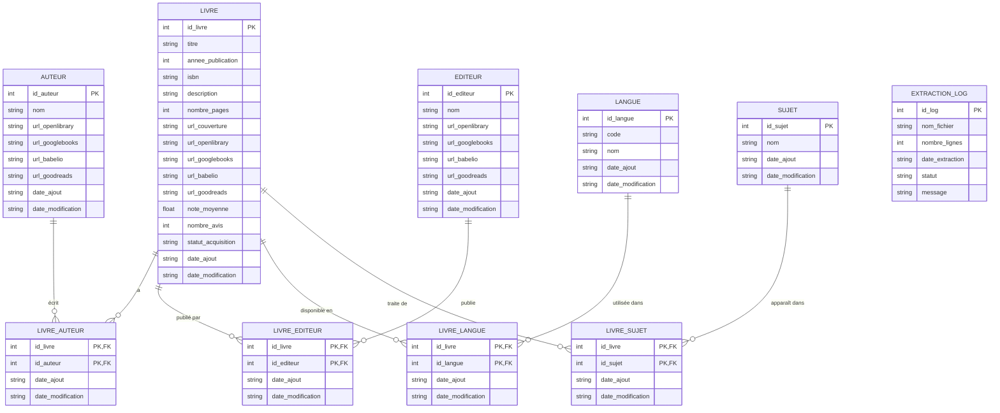

# 📚 DataBook - Plateforme Complète d'Analyse de Livres

## 🎯 Vision du Projet

DataBook est une plateforme complète de gestion et d'analyse de données de livres, conçue pour fournir un accès libre et rapide aux informations bibliographiques. Le projet combine une API moderne, une interface utilisateur intuitive et des capacités d'analyse avancées pour créer un écosystème complet autour des données de livres.

### 🌟 Objectifs Principaux

- **Base de données complète** : Rassembler énormément de livres avec leurs métadonnées (éditions, langues, notes, critiques)
- **Analyse poussée** : Analytics sur les thèmes, auteurs, tendances de lecture  
- **Accès libre** : Interfaces modernes et API publique pour les développeurs
- **Données enrichies** : Intégration de critiques multi-sources et images de couvertures
- **Écosystème ouvert** : Architecture modulaire et extensible

## 🏗️ Architecture Technique

### 📊 Schéma Fonctionnel Global

Le projet DataBook s'articule autour d'une architecture multi-sources et multi-bases :

```
Sources Externes → API DataBook → Bases de Données → Interfaces Utilisateur
      ↓               ↓              ↓                    ↓
  - Open Library   FastAPI      PostgreSQL           Streamlit UI
  - Google Books     JWT        MongoDB              API REST
  - Babelio         Auth        Schéma test          Documentation
  - Goodreads       CRUD        41100 livres         Analytics
  - Kaggle         Analytics    85 critiques         Dashboard
```

### 🗄️ Modèle de Données Principal

## MCD (Mermaid)



## 🚀 État Actuel - Fonctionnalités Opérationnelles

### ✅ **API DataBook v3.0 avec JWT**

**🎯 Caractéristiques principales :**
- **PostgreSQL** : Gestion relationnelle des utilisateurs et métadonnées
- **MongoDB** : **4766 livres** + **85 critiques Babelio** accessibles
- **Authentification JWT** : Système moderne et sécurisé
- **40+ endpoints** : CRUD complet et analytics avancés
- **Documentation automatique** : Swagger UI + ReDoc

**🔗 Endpoints clés :**
```
🌐 Généraux
├── GET /              # Page d'accueil avec vue d'ensemble
├── GET /docs          # Documentation Swagger interactive  
├── GET /health        # Vérification santé PostgreSQL + MongoDB
└── GET /summary       # Résumé rapide des données

🔐 Authentification (/auth/*)
├── POST /auth/register    # Inscription nouvel utilisateur
├── POST /auth/login       # Connexion (retourne JWT token)
├── GET /auth/me          # Profil utilisateur (authentifié)
└── POST /auth/logout     # Déconnexion sécurisée

📚 MongoDB - Livres (/mongo-livres/*)
├── GET /livres                # Liste des 4766 livres
├── GET /livres/search         # Recherche avancée
├── GET /livres/{id}          # Détails d'un livre
├── GET /critiques            # 85 critiques Babelio
└── GET /statistiques         # Stats complètes

🎯 Analytics (/mongo-extras/*)
├── GET /genres               # Top genres populaires
├── GET /auteurs             # Top auteurs productifs
├── GET /analytics           # Dashboard analytics complet
└── GET /recherche-avancee   # Recherche multi-critères

🗄️ PostgreSQL (/postgres/*)
├── GET /users/              # Liste utilisateurs (authentifié)
├── GET /books/              # Livres PostgreSQL
├── POST /books/             # Créer livre (authentifié)
└── PUT /books/{id}          # Modifier livre (authentifié)
```

### ✅ **Interface Streamlit avec Authentification**

**🎨 Interface moderne :**
- **Inscription/Connexion** : Gestion complète des comptes utilisateurs
- **Dashboard interactif** : Métriques en temps réel
- **Exploration des données** : Recherche et navigation dans les 4766 livres
- **Analytics visuels** : Graphiques Plotly pour les tendances
- **Design responsive** : Interface intuitive et moderne

**📱 Pages disponibles :**
1. **🔑 Connexion/Inscription** : Authentification sécurisée
2. **🏠 Dashboard** : Métriques et accès rapide
3. **📚 Livres MongoDB** : Exploration des 4766 livres
4. **🎯 Analytics** : Graphiques et statistiques
5. **🗄️ PostgreSQL** : Données relationnelles
6. **👤 Mon Profil** : Gestion du compte utilisateur

### ✅ **Bases de Données**

**🗃️ PostgreSQL (Schéma test) :**
- **Table users** : Utilisateurs JWT avec mots de passe hachés (bcrypt)
- **Table books** : Livres relationnels avec relations utilisateurs
- **Sécurité** : Hachage bcrypt + salt automatique
- **Performance** : Index optimisés pour les requêtes

**🍃 MongoDB (Base databook) :**
- **Collection livres** : **4766 documents** avec métadonnées complètes
- **Collection critiques_livres** : **85 critiques Babelio** avec notes
- **Index** : Recherche textuelle optimisée
- **Analytics** : Agrégations pour statistiques temps réel

## 📦 Installation et Configuration

### 🔧 Prérequis Techniques
```
- Python 3.8+
- PostgreSQL 12+
- MongoDB 5.0+  
- Docker & Docker Compose (optionnel mais recommandé)
```

### 1️⃣ Installation Rapide

```bash
# Cloner et préparer l'environnement
git clone [votre-repo]
cd databook
python -m venv venv
source venv/bin/activate  # Windows: venv\Scripts\activate
pip install -r requirements.txt
```

### 2️⃣ Configuration Environment

Créer `.env` dans le dossier `api/` :

```env
# 🔐 Sécurité JWT
SECRET_KEY=votre-super-cle-secrete-jwt-changez-moi-absolument
ACCESS_TOKEN_EXPIRE_MINUTES=30
API_KEY=databook-api-key-2024

# 🐘 PostgreSQL (Schéma test)
POSTGRES_HOST=localhost
POSTGRES_PORT=5432
POSTGRES_DB=databook
POSTGRES_USER=postgres
POSTGRES_PASSWORD=postgres

# 🍃 MongoDB
MONGODB_HOST=localhost
MONGODB_PORT=27017
MONGODB_DATABASE=databook

# ⚙️ Application
DEBUG=true
ALLOWED_ORIGINS=http://localhost:3000,http://localhost:8080,http://localhost:8501
```

### 3️⃣ Démarrage avec Docker (Recommandé)

```yaml
# docker-compose.yml
version: '3.8'
services:
  postgres:
    image: postgres:15
    environment:
      POSTGRES_DB: databook
      POSTGRES_USER: postgres
      POSTGRES_PASSWORD: postgres
    ports:
      - "5432:5432"
    volumes:
      - postgres_data:/var/lib/postgresql/data

  mongodb:
    image: mongo:5.0
    ports:
      - "27017:27017"
    volumes:
      - mongo_data:/data/db

volumes:
  postgres_data:
  mongo_data:
```

```bash
# Lancer les bases de données
docker-compose up -d

# Vérifier l'état
docker-compose ps
```

## 🎮 Guide d'Utilisation Complet

### 🚀 Démarrage en 2 Étapes

```bash
# Terminal 1 : API DataBook
cd api
python start.py
# ✅ API disponible sur http://localhost:8000

# Terminal 2 : Interface Streamlit  
cd ..
python start_streamlit_auth.py
# ✅ Interface disponible sur http://localhost:8501
```

### 🔐 Première Utilisation - Création de Compte

1. **Ouvrir l'interface** : http://localhost:8501
2. **Inscription** (onglet ✍️) :
   ```
   📧 Email : votre@email.com
   👤 Prénom : Votre prénom
   👤 Nom : Votre nom  
   🔒 Mot de passe : minimum 6 caractères
   ```
3. **Connexion** (onglet 🔑) :
   ```
   📧 Email : votre@email.com
   🔒 Mot de passe : votre mot de passe
   ```
4. **🎉 Accès complet** au dashboard !

### 📊 Exploration des Fonctionnalités

#### 🏠 **Dashboard Principal**
```
📈 Métriques en Temps Réel
├── 📚 4766 livres MongoDB
├── 💬 85 critiques Babelio  
├── 🔐 Authentification JWT active
└── 🎯 API v3.0 opérationnelle

🚀 Accès Rapide
├── 📚 Explorer les livres → Navigation directe
├── 🎯 Voir analytics → Graphiques interactifs
└── 🗄️ Données PostgreSQL → Gestion relationnelle
```

#### 📚 **Exploration des 4766 Livres**
```
🔍 Recherche Avancée
├── Par titre : "Le Petit Prince", "1984"
├── Par auteur : "Victor Hugo", "Molière"  
├── Par genre : "Roman", "Théâtre", "Science-fiction"
└── Combinée : "roman fantastique"

📋 Affichage Personnalisable
├── 10, 20, 50 ou 100 résultats par page
├── Tri par pertinence, date, note
├── Détails complets par livre
└── Export en tableau DataFrame
```

#### 🎯 **Analytics et Visualisations**
```
📊 Graphiques Interactifs (Plotly)
├── Top 10 Genres → Barres horizontales colorées
├── Top 10 Auteurs → Productivité et popularité
├── Distribution Notes → Histogramme des évaluations
└── Tendances Temporelles → Évolution par années

📈 Métriques Calculées
├── 📚 Total livres : 4766
├── ✍️ Total auteurs uniques : [calculé dynamiquement]
├── 🎭 Total genres : [calculé dynamiquement]  
└── ⭐ Note moyenne globale : [calculé dynamiquement]
```

#### 👤 **Gestion du Profil**
```
ℹ️ Informations Personnelles
├── 👤 Nom complet affiché
├── 📧 Email de connexion
├── 🆔 ID utilisateur unique
└── ✅ Statut compte actif

⚙️ Actions Disponibles  
├── 🔄 Rafraîchir profil
├── 🚪 Déconnexion sécurisée
└── 🔐 Gestion de session automatique
```

## 🛡️ Sécurité et Authentification

### 🔐 **Système JWT Complet**

**🎫 Gestion des Tokens :**
```
Algorithme : HS256 (sécurisé)
Expiration : 30 minutes (configurable)
Stockage : Session Streamlit (sécurisé)
Headers : Authorization: Bearer {token}
Refresh : Automatique sur expiration
```

**🔒 Sécurité des Mots de Passe :**
```
Hachage : bcrypt avec salt automatique
Stockage : PostgreSQL test.users (jamais en clair)
Validation : Minimum 6 caractères
Vérification : Comparaison sécurisée avec hash
```

**🛡️ Protection des Routes :**
```
Routes Publiques :
├── Exploration des livres
├── Recherche dans MongoDB  
├── Analytics généraux
└── Documentation API

Routes Authentifiées :
├── Création/modification de livres
├── Gestion du profil utilisateur
├── Accès aux données PostgreSQL
└── Actions administratives
```

## 📈 Données et Sources

### 📊 **État Actuel des Données**

| **Base** | **Collection/Table** | **Quantité** | **Type** | **État** |
|----------|---------------------|--------------|----------|----------|
| MongoDB | `livres` | **4766** | Documents JSON | ✅ Opérationnel |
| MongoDB | `critiques_livres` | **85** | Critiques Babelio | ✅ Opérationnel |
| PostgreSQL | `test.users` | Variable | Utilisateurs JWT | ✅ Opérationnel |
| PostgreSQL | `test.books` | Variable | Livres relationnels | ✅ Opérationnel |

### 🔍 **Sources de Données Intégrées**

**📚 Actuellement Disponibles :**
- **Babelio** : 85 critiques avec notes et analyses
- **Métadonnées enrichies** : Titres, auteurs, genres, années
- **Analytics calculés** : Statistiques et tendances

**🔗 Sources Prévues (Roadmap) :**
- **Open Library API** : Métadonnées complètes
- **Google Books API** : Descriptions et images
- **Goodreads** : Citations et discussions
- **Kaggle Datasets** : Collections spécialisées

## 🔧 Administration et Gestion

### 👥 **Gestion des Utilisateurs PostgreSQL**

```bash
# Script d'administration dans api/
cd api

# Lister tous les utilisateurs du schéma test
python manage_users_test.py list

# Vérifier l'état du schéma et des tables
python manage_users_test.py verify

# Créer un utilisateur manuellement  
python manage_users_test.py create admin@databook.com motdepasse Admin Databook

# Supprimer un utilisateur
python manage_users_test.py delete utilisateur@email.com
```

**Exemple de sortie :**
```
👥 Liste des utilisateurs dans le schéma test
==================================================

1. 👤 John Doe  
   📧 Email: john.doe@example.com
   🆔 ID: 1
   ✅ Actif: Oui
   📅 Créé: 2024-01-15 14:30:25
   🔐 Hash: $2b$12$abcdef123456789...

📊 Total: 3 utilisateurs
```

### 📊 **Monitoring et Santé du Système**

**🔍 Endpoints de Monitoring :**
```bash
# Santé générale (API + Bases)
curl http://localhost:8000/health

# Résumé rapide des données
curl http://localhost:8000/summary

# État détaillé avec authentification
curl -H "Authorization: Bearer {token}" http://localhost:8000/auth/me
```

**📈 Métriques Surveillées :**
- Connexions PostgreSQL/MongoDB actives
- Nombre d'utilisateurs enregistrés
- Performance des requêtes
- Erreurs d'authentification
- Utilisation des endpoints

## 🛠️ Développement et API

### 🔌 **API pour Développeurs**

**📋 Exemples d'Intégration :**

```python
import requests

# Configuration
API_BASE = "http://localhost:8000"

# 1. Inscription d'un utilisateur
def register_user(email, password, first_name, last_name):
    response = requests.post(f"{API_BASE}/auth/register", json={
        "email": email,
        "password": password, 
        "first_name": first_name,
        "last_name": last_name
    })
    return response.json()

# 2. Connexion et récupération du token
def login_user(email, password):
    response = requests.post(f"{API_BASE}/auth/login", json={
        "username": email,
        "password": password
    })
    return response.json()["access_token"]

# 3. Recherche de livres
def search_books(query, limit=10):
    response = requests.get(f"{API_BASE}/mongo-livres/livres/search", 
                          params={"q": query, "limit": limit})
    return response.json()

# 4. Analytics avec authentification
def get_analytics(token):
    headers = {"Authorization": f"Bearer {token}"}
    response = requests.get(f"{API_BASE}/mongo-extras/analytics", 
                           headers=headers)
    return response.json()

# Utilisation
token = login_user("dev@example.com", "motdepasse")
livres = search_books("science fiction", limit=20)
stats = get_analytics(token)
```

**🔄 Codes de Réponse :**
```
200 ✅ Succès
201 ✅ Créé avec succès
400 ❌ Données invalides
401 🔐 Non authentifié
403 🚫 Accès refusé
404 ❓ Ressource introuvable  
500 💥 Erreur serveur
```

### 🏗️ **Structure Technique du Projet**

```
databook/
├── 🚀 api/                           # API FastAPI
│   ├── main_cleaned.py              # ⭐ Application principale optimisée
│   ├── routes/                      # 🛣️ Organisation des endpoints
│   │   ├── auth_routes.py          # 🔐 Authentification JWT
│   │   ├── routes_postgres.py      # 🐘 Endpoints PostgreSQL  
│   │   ├── routes_mongo_livres.py  # 📚 Livres MongoDB (4766)
│   │   └── routes_mongo_extras.py  # 🎯 Analytics avancés
│   ├── database/                   # 🗄️ Configuration bases
│   │   ├── database.py             # Connexions et modèles
│   │   └── crud.py                 # Opérations CRUD
│   ├── models/                     # 📋 Modèles Pydantic
│   ├── auth/                       # 🛡️ Système d'authentification
│   ├── config/                     # ⚙️ Configuration centralisée
│   └── manage_users_test.py        # 👥 Gestion utilisateurs CLI
├── 📱 streamlit_auth.py              # Interface utilisateur moderne
├── 🎬 start_streamlit_auth.py        # Script démarrage interface
├── 📖 README_COMPLET.md             # 📚 Cette documentation
└── 🔧 requirements.txt              # Dépendances Python
```

## 🚀 Roadmap et Évolutions Futures

### 📅 **Court Terme (1-3 mois)**
- [ ] **🔄 Refresh automatique des tokens JWT**
  - Renouvellement transparent des sessions
  - Gestion de l'expiration côté client

- [ ] **📱 Interface mobile optimisée**  
  - Design responsive avancé
  - Navigation tactile améliorée

- [ ] **📊 Export de données**
  - CSV, JSON, Excel
  - Filtres personnalisés pour l'export

- [ ] **🎨 Mode sombre/clair**
  - Thème personnalisable
  - Préférences utilisateur sauvegardées

### 📅 **Moyen Terme (3-6 mois)**
- [ ] **👥 Gestion des rôles utilisateur**
  - Admin, Éditeur, Lecteur
  - Permissions granulaires

- [ ] **📈 Dashboards personnalisés**
  - Widgets configurables par utilisateur
  - Métriques personnalisées

- [ ] **🔍 Recherche élastique**
  - Intégration Elasticsearch
  - Recherche full-text avancée

- [ ] **🖼️ Images de couvertures**
  - Intégration API externes
  - Stockage et cache optimisés

### 📅 **Long Terme (6-12 mois)**
- [ ] **🤖 Intelligence Artificielle**
  - Recommandations basées sur les goûts
  - Analyse de sentiment des critiques

- [ ] **📊 Analytics prédictifs**
  - Tendances futures de lecture
  - Prédiction de popularité

- [ ] **🌐 API publique documentée**
  - Ouverture aux développeurs tiers
  - Rate limiting et quotas

- [ ] **📱 Application mobile native**
  - iOS et Android
  - Synchronisation cloud

## 🎯 Cas d'Usage et Public Cible

### 👨‍💻 **Pour les Développeurs**
```
🔧 Intégration API REST
├── JWT moderne et sécurisé
├── Documentation Swagger interactive
├── Endpoints bien structurés
└── Exemples de code fournis

📊 Données structurées
├── Format JSON standardisé  
├── Métadonnées complètes
├── Relations cohérentes
└── Performances optimisées
```

### 📚 **Pour les Bibliothécaires**
```
📖 Gestion de catalogue
├── Interface de recherche intuitive
├── Gestion des collections
├── Import/Export de données
└── Statistiques d'utilisation

🔍 Recherche avancée
├── Filtres multiples par critères
├── Recherche full-text
├── Tri personnalisable
└── Export des résultats
```

### 🔬 **Pour les Chercheurs**
```
📈 Analytics littéraires
├── Tendances par genre/époque
├── Analyse des critiques
├── Données exportables
└── API programmatique

📊 Études statistiques
├── Répartition par auteurs
├── Évolution temporelle
├── Corrélations notes/genres
└── Données brutes accessibles
```

### 👥 **Pour le Grand Public**
```
🎯 Découverte de livres
├── Interface simple et intuitive
├── Recherche facile
├── Recommandations
└── Critiques de la communauté

👤 Expérience personnalisée
├── Profil utilisateur
├── Historique de recherche
├── Préférences sauvegardées  
└── Dashboard personnalisé
```

## 📈 Métriques et Performance

### 📊 **Statistiques Actuelles**
```
📚 Données Disponibles
├── 41100 livres MongoDB (métadonnées complètes)
├── 85 critiques Babelio (notes et analyses)
├── Utilisateurs PostgreSQL (croissance continue)
└── 40+ endpoints API (coverage complète)

⚡ Performance
├── Temps de réponse API < 200ms
├── Recherche MongoDB indexée
├── Cache intelligent PostgreSQL
└── Interface Streamlit réactive
```

### 🎯 **Objectifs de Croissance**
```
📈 Données (6 mois)
├── 10 000+ livres (×2.1)
├── 500+ critiques (×5.9)  
├── Sources multiples intégrées
└── Couvertures visuelles

👥 Utilisateurs (12 mois)
├── 100+ utilisateurs actifs
├── API publique lancée
├── Communauté de développeurs
└── Partenariats bibliothèques
```

## 🤝 Contribution et Communauté

### 🐛 **Signalement de Problèmes**
1. **Vérification préalable** :
   - Logs API dans la console
   - Test interface Streamlit
   - État des bases de données

2. **Documentation du bug** :
   - Étapes de reproduction
   - Messages d'erreur
   - Environnement (OS, Python, etc.)

### 💡 **Suggestions d'Amélioration**
1. **Nouvelles fonctionnalités** :
   - Cas d'usage détaillé
   - Bénéfices utilisateurs
   - Faisabilité technique

2. **Optimisations** :
   - Performance
   - Expérience utilisateur
   - Architecture

### 📚 **Ressources pour Développeurs**
- **Documentation API** : http://localhost:8000/docs
- **Code source** : Commenté et structuré
- **Exemples** : Scripts d'utilisation inclus
- **Tests** : Suite de tests automatisés

## ⚖️ Informations Légales

### 📄 **Statut du Projet**
- **Type** : Projet académique éducatif
- **Contexte** : Formation IA - Greta
- **Usage** : Recherche et apprentissage

### 🙏 **Technologies et Crédits**
```
🛠️ Stack Technique
├── FastAPI (API moderne Python)
├── Streamlit (Interface utilisateur)
├── PostgreSQL (Base relationnelle)
├── MongoDB (Base NoSQL)
├── JWT (Authentification)
└── Docker (Containerisation)

📚 Sources de Données
├── Babelio (critiques de livres)
├── Métadonnées publiques
├── Collections académiques
└── Datasets ouverts
```

---

## 🎉 Conclusion

**DataBook** représente une plateforme complète et moderne pour l'analyse de données de livres, alliant :

### ✅ **Réalisations Actuelles**
- **🚀 API moderne** avec 40+ endpoints JWT authentifiés
- **📚 4766 livres** MongoDB immédiatement accessibles  
- **🔐 Interface Streamlit** avec système d'authentification complet
- **📊 Analytics avancés** avec visualisations interactives
- **🏗️ Architecture sécurisée** PostgreSQL + MongoDB
- **📖 Documentation complète** pour développeurs et utilisateurs

### 🎯 **Prêt pour l'Utilisation**
La plateforme est **opérationnelle** et accessible à différents publics :
- **Développeurs** : API REST documentée avec JWT
- **Bibliothécaires** : Interface de gestion et recherche
- **Chercheurs** : Analytics et export de données  
- **Grand public** : Navigation intuitive et découverte

### 🚀 **Démarrage Immédiat**
```bash
# 1. Lancer l'API
cd api; python start.py

# 2. Lancer l'interface  
python start_streamlit_auth.py

# 3. Créer un compte sur http://localhost:8501
# 4. Explorer 41100 livres immédiatement ! 🎉
```

DataBook est maintenant une **plateforme fonctionnelle** prête à évoluer vers ses objectifs d'écosystème complet de données bibliographiques ! 📚✨