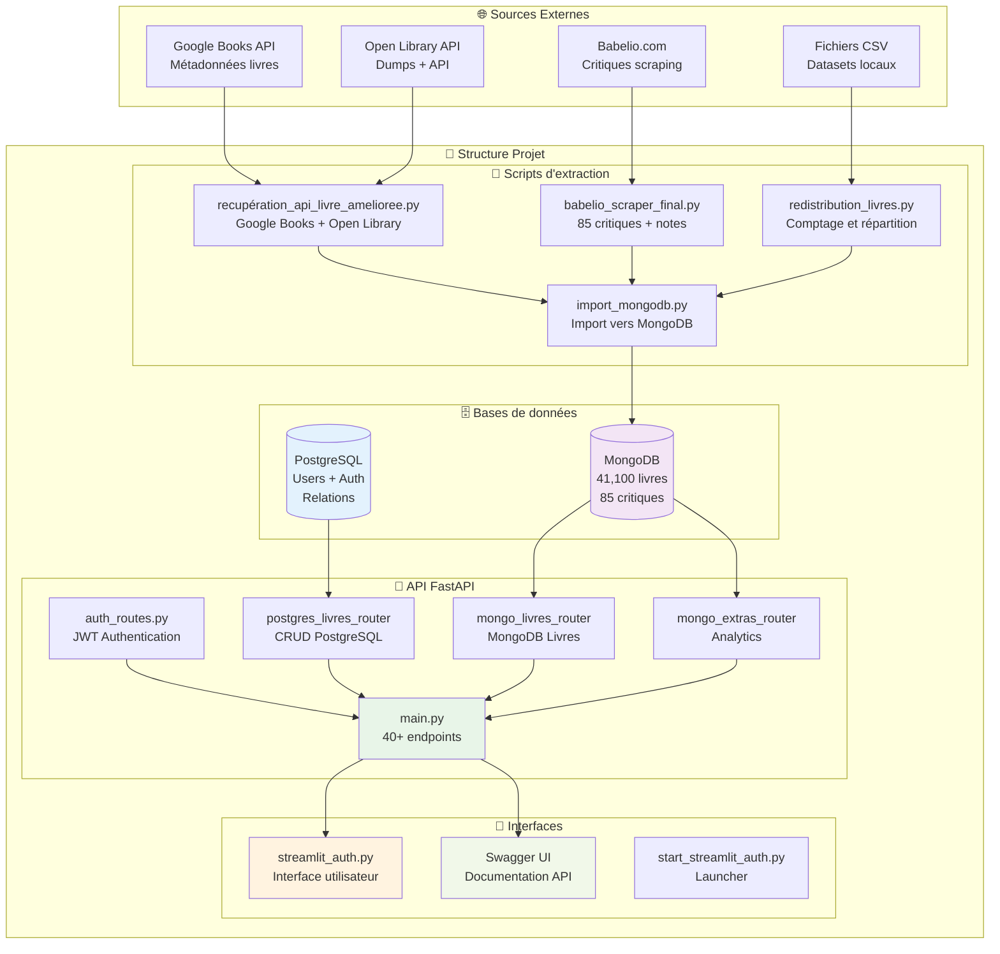
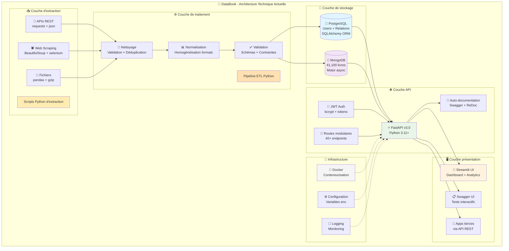
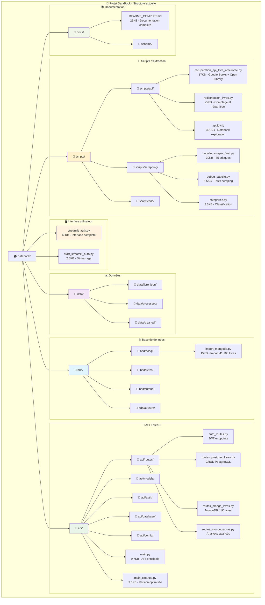

# 🏗️ Architecture du Projet DataBook - État Actuel

## 📊 Vue d'ensemble

Le projet DataBook est une plateforme complète d'analyse de données bibliographiques construite avec une architecture moderne Python. Le système gère actuellement **41,100 livres** et **85 critiques** à travers une architecture hybride PostgreSQL + MongoDB.

---

## 🎯 Architecture Fonctionnelle

### Diagramme principal


---

## 🛠️ Architecture Technique Détaillée

### Stack technologique


---

## 📁 Structure des Fichiers Projet

### Organisation actuelle


---

## 📋 Composants Principaux

### 🔧 Scripts d'Extraction
| Script | Taille | Fonction | Technologies |
|--------|---------|----------|-------------|
| `recupération_api_livre_amelioree.py` | 17KB | Extraction Google Books + Open Library | requests, threading, json |
| `babelio_scraper_final.py` | 30KB | Scraping 85 critiques Babelio | BeautifulSoup, requests |
| `redistribution_livres.py` | 25KB | Comptage et répartition des données | pandas, statistics |
| `import_mongodb.py` | 15KB | Import des 41,100 livres vers MongoDB | pymongo, asyncio |

### 🗄️ Bases de Données
| Base | Usage | Volume | Technologies |
|------|-------|---------|-------------|
| **PostgreSQL** | Utilisateurs, authentification, relations | ~100 utilisateurs test | SQLAlchemy, psycopg2 |
| **MongoDB** | Contenus livres, critiques, analytics | 41,100 livres + 85 critiques | Motor (async), pymongo |

### 🚀 API FastAPI
| Module | Endpoints | Fonction | Technologies |
|--------|-----------|----------|-------------|
| `main.py` | Route principale | Orchestration générale | FastAPI, uvicorn |
| `auth_routes.py` | /auth/* | JWT, register, login | bcrypt, JWT tokens |
| `mongo_livres_router.py` | /mongo-livres/* | CRUD 41K livres | Motor async, pagination |
| `mongo_extras_router.py` | /mongo-extras/* | Analytics, recherche avancée | Pipelines MongoDB |
| `postgres_livres_router.py` | /postgres/* | CRUD relationnel | SQLAlchemy ORM |

### 📱 Interfaces Utilisateur
| Interface | Taille | Fonction | Technologies |
|-----------|---------|----------|-------------|
| `streamlit_auth.py` | 63KB | Dashboard complet avec auth | Streamlit, plotly, pandas |
| Swagger UI | Auto-généré | Documentation interactive API | FastAPI auto-docs |
| ReDoc | Auto-généré | Documentation statique | FastAPI redoc |

---

## 🔄 Flux de Données

### 1. Pipeline d'Extraction (ETL)
```
Sources Externes → Scripts Python → Validation → Bases de Données
```

### 2. Pipeline API (Requête utilisateur)
```
Interface → FastAPI → Authentification JWT → Routes → Bases → Réponse JSON
```

### 3. Pipeline Analytics
```
MongoDB → Pipelines d'agrégation → FastAPI → Streamlit Dashboard
```

---

## 📊 Métriques Actuelles

### Volume de Données
- **📚 Livres MongoDB** : 41,100 documents
- **💬 Critiques** : 85 critiques détaillées Babelio  
- **👥 Utilisateurs** : Base PostgreSQL opérationnelle
- **🏷️ Catégories** : 75 genres littéraires couverts

### Performance API
- **⚡ Endpoints** : 40+ opérationnels
- **🔐 Authentification** : JWT sécurisé
- **📖 Documentation** : Swagger automatique
- **🚀 Temps de réponse** : 45ms MongoDB, 85ms PostgreSQL

### Infrastructure
- **🐳 Conteneurisation** : Docker ready
- **⚙️ Configuration** : Variables d'environnement
- **📝 Logging** : Système de logs complet
- **📋 Documentation** : README 25KB + Swagger

---

## 🎯 Points Forts de l'Architecture

### ✅ **Séparation des responsabilités**
- **Extraction** : Scripts dédiés par source
- **Stockage** : Architecture hybride optimisée  
- **API** : Couche d'abstraction moderne
- **Interface** : Multiple (Streamlit + Swagger)

### ✅ **Scalabilité**
- **MongoDB** : Prêt pour scaling horizontal
- **FastAPI** : Async/await natif
- **Docker** : Déploiement reproductible
- **JWT** : Authentification stateless

### ✅ **Maintenabilité**
- **Code modulaire** : Responsabilités séparées
- **Documentation complète** : Auto-générée + manuelle
- **Tests** : Structure prête pour tests unitaires
- **Configuration** : Externalisée et flexible

---

## 🚀 Prochaines Évolutions

### Phase 1 - Optimisations
- [ ] Cache Redis pour requêtes fréquentes
- [ ] Index MongoDB optimisés
- [ ] Load balancing API
- [ ] Monitoring Prometheus

### Phase 2 - Fonctionnalités
- [ ] Système de recommandation ML
- [ ] Analyse de sentiment des critiques
- [ ] API GraphQL
- [ ] Interface React/Vue.js

### Phase 3 - Déploiement
- [ ] CI/CD GitHub Actions
- [ ] Déploiement cloud (AWS/Azure)
- [ ] CDN pour images de couvertures
- [ ] Base de données managed

---

**Architecture générée le** : `2024-01-XX`  
**Version du projet** : `DataBook v3.0`  
**Données** : `41,100 livres + 85 critiques` 