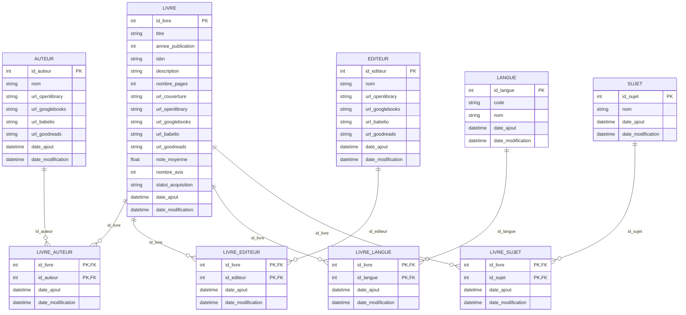
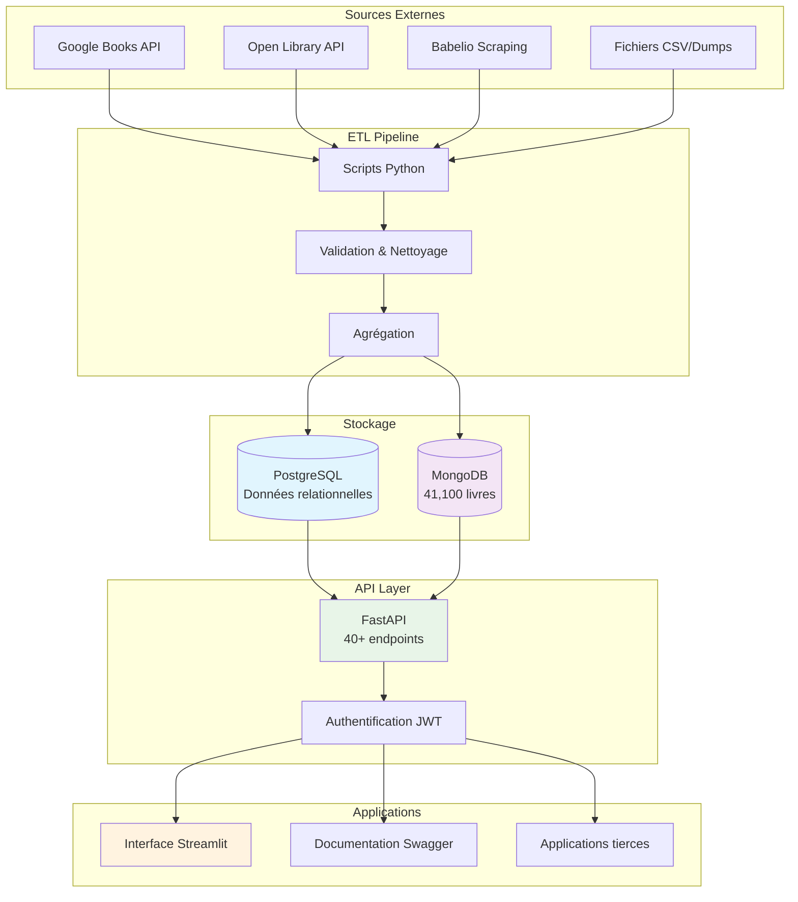
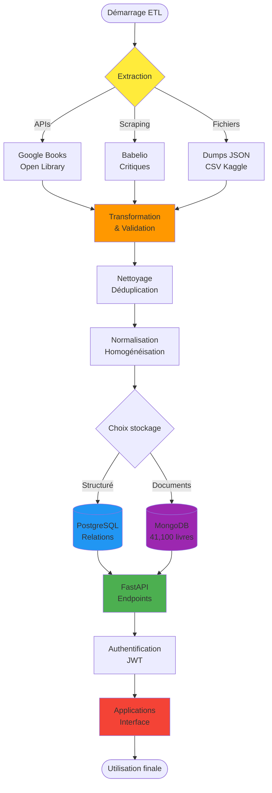
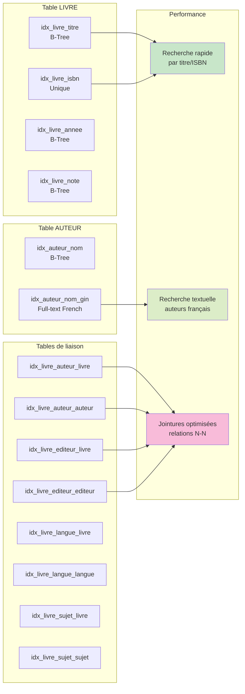

# 📊 DataBook - Diagrammes Mermaid

Ce fichier contient tous les diagrammes Mermaid pour le projet DataBook : MLD et MPD.

## 📋 MLD (Modèle Logique de Données)

### Description
Le MLD représente la structure logique des données avec les relations entre les entités, indépendamment du SGBD.

## 🗄️ MPD (Modèle Physique de Données) - PostgreSQL

### Description
Le MPD représente l'implémentation physique avec les types de données PostgreSQL, contraintes et optimisations.

```mermaid
erDiagram
    LIVRE {
        SERIAL id_livre PK "PRIMARY KEY"
        VARCHAR_500 titre "NOT NULL"
        INTEGER annee_publication "CHECK (annee_publication > 0)"
        VARCHAR_20 isbn "UNIQUE INDEX"
        TEXT description
        INTEGER nombre_pages "CHECK (nombre_pages > 0)"
        VARCHAR_500 url_couverture
        VARCHAR_500 url_openlibrary
        VARCHAR_500 url_googlebooks
        VARCHAR_500 url_babelio
        VARCHAR_500 url_goodreads
        DECIMAL_3_1 note_moyenne "CHECK (note_moyenne >= 0 AND note_moyenne <= 10)"
        INTEGER nombre_avis "DEFAULT 0"
        VARCHAR_50 statut_acquisition "DEFAULT 'disponible'"
        TIMESTAMP date_ajout "DEFAULT CURRENT_TIMESTAMP"
        TIMESTAMP date_modification "DEFAULT CURRENT_TIMESTAMP"
    }
    
    AUTEUR {
        SERIAL id_auteur PK "PRIMARY KEY"
        VARCHAR_200 nom "NOT NULL INDEX"
        VARCHAR_500 url_openlibrary
        VARCHAR_500 url_googlebooks
        VARCHAR_500 url_babelio
        VARCHAR_500 url_goodreads
        TIMESTAMP date_ajout "DEFAULT CURRENT_TIMESTAMP"
        TIMESTAMP date_modification "DEFAULT CURRENT_TIMESTAMP"
    }
    
    EDITEUR {
        SERIAL id_editeur PK "PRIMARY KEY"
        VARCHAR_200 nom "NOT NULL INDEX"
        VARCHAR_500 url_openlibrary
        VARCHAR_500 url_googlebooks
        VARCHAR_500 url_babelio
        VARCHAR_500 url_goodreads
        TIMESTAMP date_ajout "DEFAULT CURRENT_TIMESTAMP"
        TIMESTAMP date_modification "DEFAULT CURRENT_TIMESTAMP"
    }
    
    LANGUE {
        SERIAL id_langue PK "PRIMARY KEY"
        VARCHAR_10 code "NOT NULL UNIQUE"
        VARCHAR_100 nom "NOT NULL"
        TIMESTAMP date_ajout "DEFAULT CURRENT_TIMESTAMP"
        TIMESTAMP date_modification "DEFAULT CURRENT_TIMESTAMP"
    }
    
    SUJET {
        SERIAL id_sujet PK "PRIMARY KEY"
        VARCHAR_200 nom "NOT NULL INDEX"
        TIMESTAMP date_ajout "DEFAULT CURRENT_TIMESTAMP"
        TIMESTAMP date_modification "DEFAULT CURRENT_TIMESTAMP"
    }
    
    LIVRE_AUTEUR {
        INTEGER id_livre PK,FK "REFERENCES LIVRE(id_livre) ON DELETE CASCADE"
        INTEGER id_auteur PK,FK "REFERENCES AUTEUR(id_auteur) ON DELETE CASCADE"
        TIMESTAMP date_ajout "DEFAULT CURRENT_TIMESTAMP"
        TIMESTAMP date_modification "DEFAULT CURRENT_TIMESTAMP"
    }
    
    LIVRE_EDITEUR {
        INTEGER id_livre PK,FK "REFERENCES LIVRE(id_livre) ON DELETE CASCADE"
        INTEGER id_editeur PK,FK "REFERENCES EDITEUR(id_editeur) ON DELETE CASCADE"
        TIMESTAMP date_ajout "DEFAULT CURRENT_TIMESTAMP"
        TIMESTAMP date_modification "DEFAULT CURRENT_TIMESTAMP"
    }
    
    LIVRE_LANGUE {
        INTEGER id_livre PK,FK "REFERENCES LIVRE(id_livre) ON DELETE CASCADE"
        INTEGER id_langue PK,FK "REFERENCES LANGUE(id_langue) ON DELETE CASCADE"
        TIMESTAMP date_ajout "DEFAULT CURRENT_TIMESTAMP"
        TIMESTAMP date_modification "DEFAULT CURRENT_TIMESTAMP"
    }
    
    LIVRE_SUJET {
        INTEGER id_livre PK,FK "REFERENCES LIVRE(id_livre) ON DELETE CASCADE"
        INTEGER id_sujet PK,FK "REFERENCES SUJET(id_sujet) ON DELETE CASCADE"
        TIMESTAMP date_ajout "DEFAULT CURRENT_TIMESTAMP"
        TIMESTAMP date_modification "DEFAULT CURRENT_TIMESTAMP"
    }

    LIVRE ||--o{ LIVRE_AUTEUR : "FK CASCADE"
    AUTEUR ||--o{ LIVRE_AUTEUR : "FK CASCADE"
    LIVRE ||--o{ LIVRE_EDITEUR : "FK CASCADE"
    EDITEUR ||--o{ LIVRE_EDITEUR : "FK CASCADE"
    LIVRE ||--o{ LIVRE_LANGUE : "FK CASCADE"
    LANGUE ||--o{ LIVRE_LANGUE : "FK CASCADE"
    LIVRE ||--o{ LIVRE_SUJET : "FK CASCADE"
    SUJET ||--o{ LIVRE_SUJET : "FK CASCADE"
```

## 🏗️ Architecture système (Vue d'ensemble)

### Description
Diagramme de l'architecture générale du système DataBook avec les sources de données et les APIs.

## 📱 Flow des données (Flux principal)

### Description
Diagramme du flux de données depuis l'extraction jusqu'à l'utilisation finale.

## 🔧 Index et Optimisations

### Description
Diagramme des index et optimisations appliquées sur la base PostgreSQL.

## 📝 Utilisation

### Comment utiliser ces diagrammes

1. **Copier le code Mermaid** de la section souhaitée
2. **Coller dans un éditeur Mermaid** (GitLab, GitHub, VS Code avec extension, etc.)
3. **Ou utiliser les outils en ligne** comme [Mermaid Live Editor](https://mermaid.live/)

### Intégration dans la documentation

Ces diagrammes peuvent être intégrés dans :
- **README.md** du projet
- **Documentation technique**
- **Rapports** (comme votre rapport de formation)
- **Présentations** techniques

### Modification

Pour modifier les diagrammes :
1. Éditer le code Mermaid correspondant
2. Tester avec Mermaid Live Editor
3. Mettre à jour ce fichier

---

**Projet DataBook** - Diagrammes générés pour 41,100 livres et architecture PostgreSQL + MongoDB 