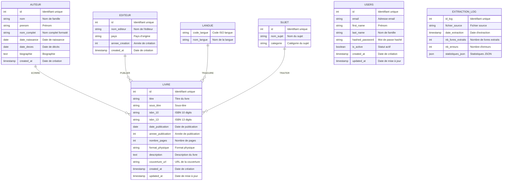
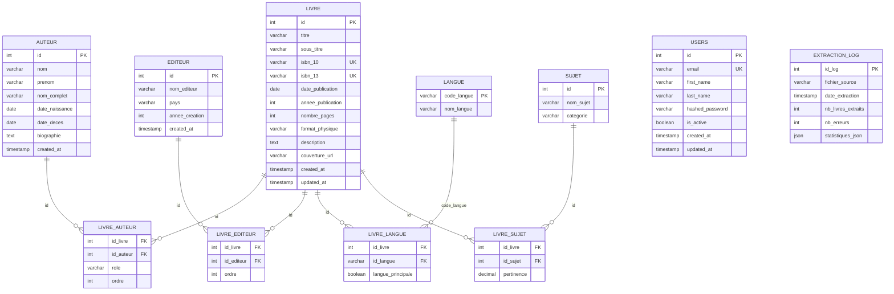
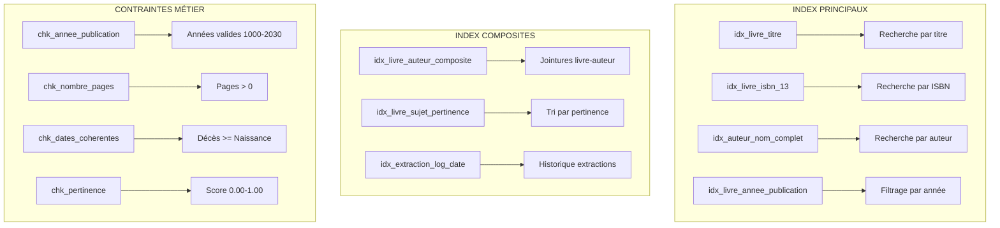
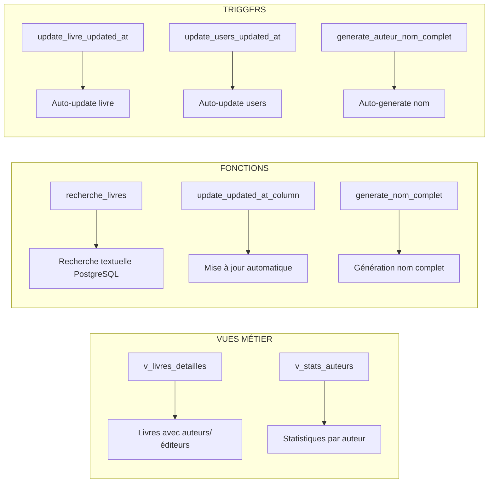
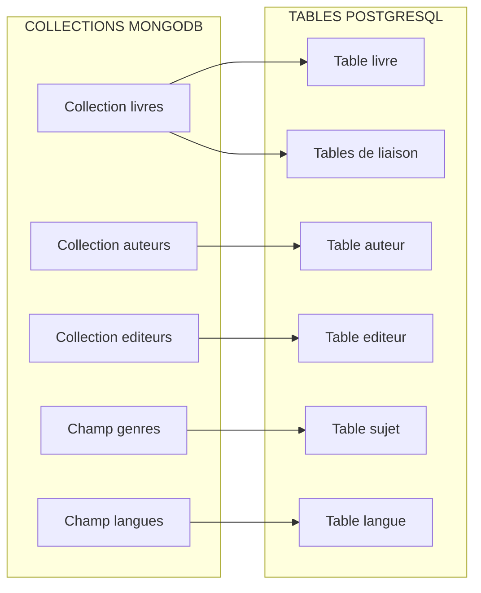

# DATABOOK - DIAGRAMMES MERMAID
*Modèles de données basés sur la structure MongoDB existante*

---

## 1. MCD - MODÈLE CONCEPTUEL DE DONNÉES

---

## 2. MLD - MODÈLE LOGIQUE DE DONNÉES

---

## 3. MPD - MODÈLE PHYSIQUE DE DONNÉES (PostgreSQL)

```mermaid
erDiagram
    auteur {
        SERIAL id PK
        VARCHAR_255 nom
        VARCHAR_255 prenom
        VARCHAR_511 nom_complet
        DATE date_naissance
        DATE date_deces
        TEXT biographie
        TIMESTAMP created_at
    }
    
    editeur {
        SERIAL id PK
        VARCHAR_255 nom_editeur "NOT NULL"
        VARCHAR_100 pays
        INTEGER annee_creation
        TIMESTAMP created_at "DEFAULT CURRENT_TIMESTAMP"
    }
    
    livre {
        SERIAL id PK
        VARCHAR_500 titre "NOT NULL"
        VARCHAR_500 sous_titre
        VARCHAR_10 isbn_10 "UNIQUE"
        VARCHAR_13 isbn_13 "UNIQUE"
        DATE date_publication
        INTEGER annee_publication "CHECK 1000-2030"
        INTEGER nombre_pages "CHECK > 0"
        VARCHAR_50 format_physique
        TEXT description
        VARCHAR_1000 couverture_url
        TIMESTAMP created_at "DEFAULT CURRENT_TIMESTAMP"
        TIMESTAMP updated_at "DEFAULT CURRENT_TIMESTAMP"
    }
    
    langue {
        VARCHAR_10 code_langue PK
        VARCHAR_100 nom_langue "NOT NULL"
    }
    
    sujet {
        SERIAL id PK
        VARCHAR_255 nom_sujet "NOT NULL"
        VARCHAR_100 categorie
    }
    
    users {
        SERIAL id PK
        VARCHAR_255 email "UNIQUE NOT NULL"
        VARCHAR_100 first_name
        VARCHAR_100 last_name
        VARCHAR_255 hashed_password "NOT NULL"
        BOOLEAN is_active "DEFAULT TRUE"
        TIMESTAMP created_at "DEFAULT CURRENT_TIMESTAMP"
        TIMESTAMP updated_at "DEFAULT CURRENT_TIMESTAMP"
    }
    
    extraction_log {
        SERIAL id_log PK
        VARCHAR_255 fichier_source
        TIMESTAMP date_extraction "DEFAULT CURRENT_TIMESTAMP"
        INTEGER nb_livres_extraits "DEFAULT 0"
        INTEGER nb_erreurs "DEFAULT 0"
        JSONB statistiques_json
    }
    
    livre_auteur {
        INTEGER id_livre FK "NOT NULL"
        INTEGER id_auteur FK "NOT NULL"
        VARCHAR_50 role "DEFAULT 'auteur'"
        INTEGER ordre "DEFAULT 1"
    }
    
    livre_editeur {
        INTEGER id_livre FK "NOT NULL"
        INTEGER id_editeur FK "NOT NULL"
        INTEGER ordre "DEFAULT 1"
    }
    
    livre_langue {
        INTEGER id_livre FK "NOT NULL"
        VARCHAR_10 id_langue FK "NOT NULL"
        BOOLEAN langue_principale "DEFAULT FALSE"
    }
    
    livre_sujet {
        INTEGER id_livre FK "NOT NULL"
        INTEGER id_sujet FK "NOT NULL"
        DECIMAL_3_2 pertinence "DEFAULT 1.00, CHECK 0.00-1.00"
    }

    auteur ||--o{ livre_auteur : "id"
    livre ||--o{ livre_auteur : "id"
    editeur ||--o{ livre_editeur : "id"
    livre ||--o{ livre_editeur : "id"
    langue ||--o{ livre_langue : "code_langue"
    livre ||--o{ livre_langue : "id"
    sujet ||--o{ livre_sujet : "id"
    livre ||--o{ livre_sujet : "id"
```

---

## 4. ARCHITECTURE DES INDEX ET PERFORMANCES

---

## 5. VUES ET FONCTIONS UTILITAIRES

---

## 6. CORRESPONDANCE MONGODB ↔ POSTGRESQL

---

## 📊 STATISTIQUES ET MÉTRIQUES

- **8 tables principales** + **4 tables de liaison**
- **25+ index optimisés** pour performances
- **6 contraintes métier** pour intégrité
- **3 triggers automatiques** pour maintenance
- **2 vues prédéfinies** pour requêtes complexes
- **1 fonction de recherche** textuelle avancée
- **Compatibilité PostgreSQL 12+** avec JSONB
- **Support complet UTF-8** pour international
