# DATABOOK - DIAGRAMMES MERMAID
*Modèles de données basés sur la structure MongoDB existante*

---

## 1. MCD - MODÈLE CONCEPTUEL DE DONNÉES

```mermaid
erDiagram
    AUTEUR {
        int id "Identifiant unique"
        string nom "Nom de famille"
        string prenom "Prénom"
        string nom_complet "Nom complet formaté"
        date date_naissance "Date de naissance"
        date date_deces "Date de décès"
        text biographie "Biographie"
        timestamp created_at "Date de création"
    }
    
    EDITEUR {
        int id "Identifiant unique"
        string nom_editeur "Nom de l'éditeur"
        string pays "Pays d'origine"
        int annee_creation "Année de création"
        timestamp created_at "Date de création"
    }
    
    LIVRE {
        int id "Identifiant unique"
        string titre "Titre du livre"
        string sous_titre "Sous-titre"
        string isbn_10 "ISBN 10 digits"
        string isbn_13 "ISBN 13 digits"
        date date_publication "Date de publication"
        int annee_publication "Année de publication"
        int nombre_pages "Nombre de pages"
        string format_physique "Format physique"
        text description "Description du livre"
        string couverture_url "URL de la couverture"
        timestamp created_at "Date de création"
        timestamp updated_at "Date de mise à jour"
    }
    
    LANGUE {
        string code_langue "Code ISO langue"
        string nom_langue "Nom de la langue"
    }
    
    SUJET {
        int id "Identifiant unique"
        string nom_sujet "Nom du sujet"
        string categorie "Catégorie du sujet"
    }
    
    USERS {
        int id "Identifiant unique"
        string email "Adresse email"
        string first_name "Prénom"
        string last_name "Nom de famille"
        string hashed_password "Mot de passe hashé"
        boolean is_active "Statut actif"
        timestamp created_at "Date de création"
        timestamp updated_at "Date de mise à jour"
    }
    
    EXTRACTION_LOG {
        int id_log "Identifiant unique"
        string fichier_source "Fichier source"
        timestamp date_extraction "Date d'extraction"
        int nb_livres_extraits "Nombre de livres extraits"
        int nb_erreurs "Nombre d'erreurs"
        json statistiques_json "Statistiques JSON"
    }

    AUTEUR ||--o{ LIVRE : "ECRIRE"
    EDITEUR ||--o{ LIVRE : "PUBLIER"
    LANGUE ||--o{ LIVRE : "TRADUIRE"
    SUJET ||--o{ LIVRE : "TRAITER"
```

---

## 2. MLD - MODÈLE LOGIQUE DE DONNÉES

---

## 3. MPD - MODÈLE PHYSIQUE DE DONNÉES (PostgreSQL)

---

## 4. ARCHITECTURE DES INDEX ET PERFORMANCES

```mermaid
graph TB
    subgraph "INDEX PRINCIPAUX"
        A[idx_livre_titre] --> B[Recherche par titre]
        C[idx_livre_isbn_13] --> D[Recherche par ISBN]
        E[idx_auteur_nom_complet] --> F[Recherche par auteur]
        G[idx_livre_annee_publication] --> H[Filtrage par année]
    end
    
    subgraph "INDEX COMPOSITES"
        I[idx_livre_auteur_composite] --> J[Jointures livre-auteur]
        K[idx_livre_sujet_pertinence] --> L[Tri par pertinence]
        M[idx_extraction_log_date] --> N[Historique extractions]
    end
    
    subgraph "CONTRAINTES MÉTIER"
        O[chk_annee_publication] --> P[Années valides 1000-2030]
        Q[chk_nombre_pages] --> R[Pages > 0]
        S[chk_dates_coherentes] --> T[Décès >= Naissance]
        U[chk_pertinence] --> V[Score 0.00-1.00]
    end
```

---

## 5. VUES ET FONCTIONS UTILITAIRES

```mermaid
graph LR
    subgraph "VUES MÉTIER"
        A[v_livres_detailles] --> B[Livres avec auteurs/éditeurs]
        C[v_stats_auteurs] --> D[Statistiques par auteur]
    end
    
    subgraph "FONCTIONS"
        E[recherche_livres] --> F[Recherche textuelle PostgreSQL]
        G[update_updated_at_column] --> H[Mise à jour automatique]
        I[generate_nom_complet] --> J[Génération nom complet]
    end
    
    subgraph "TRIGGERS"
        K[update_livre_updated_at] --> L[Auto-update livre]
        M[update_users_updated_at] --> N[Auto-update users]
        O[generate_auteur_nom_complet] --> P[Auto-generate nom]
    end
```

---

## 6. CORRESPONDANCE MONGODB ↔ POSTGRESQL

---

## 📊 STATISTIQUES ET MÉTRIQUES

- **8 tables principales** + **4 tables de liaison**
- **25+ index optimisés** pour performances
- **6 contraintes métier** pour intégrité
- **3 triggers automatiques** pour maintenance
- **2 vues prédéfinies** pour requêtes complexes
- **1 fonction de recherche** textuelle avancée
- **Compatibilité PostgreSQL 12+** avec JSONB
- **Support complet UTF-8** pour international
